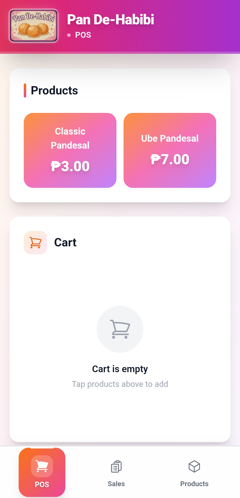
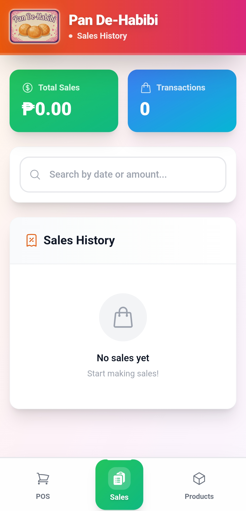
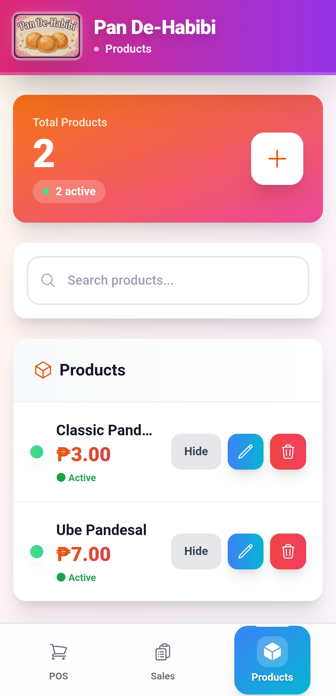
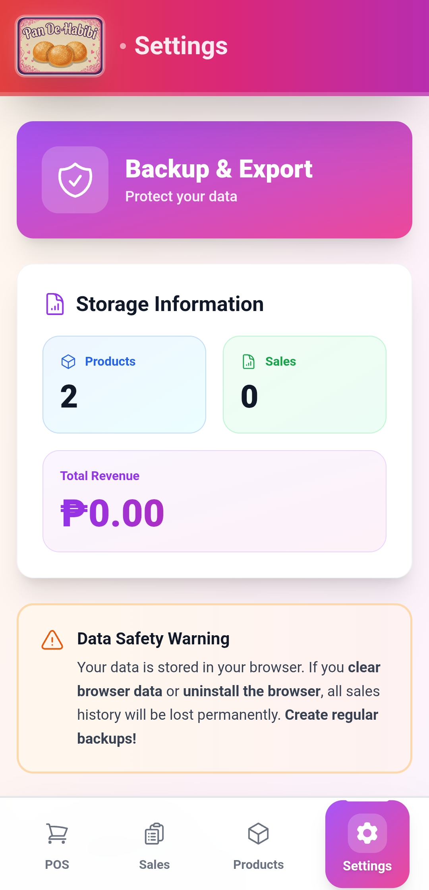

# 🥖 Pan De-Habibi POS

**An offline-first mobile Point of Sale system for Pan De-Habibi bakery**

A simple, fast, and reliable POS app that works even without internet. Built for bakery cashiers to process sales quickly on mobile devices.

---

## 📱 Screenshots

| POS Page | Sales History | Products Management | Settings & Backup |
|----------|---------------|---------------------|-------------------|
|  |  |  |  |

---

## ✨ Features

### 🛒 Point of Sale
- Tap products to add to cart
- Adjust quantities with +/- buttons
- Calculate change automatically
- Complete sales with one tap

### 📊 Sales History
- View all past transactions
- Tap any sale to see details
- Search by date or amount
- See total sales and revenue

### 📦 Product Management
- Add, edit, or delete products
- Set prices and product names
- Toggle products on/off without deleting
- Search and filter products

### 🛡️ Backup & Export
- Create full backup of all data
- Export sales to CSV format
- Export products to CSV format
- Restore data from backup files
- View storage statistics

### 📱 Works Offline
- All data stored on your device
- No internet required
- Works like a native mobile app
- Install to home screen

---

## 🚀 Live Demo

Visit: **[Pan De-Habibi App](https://pan-de-habibi-mobile.vercel.app/)**

**On mobile:**
1. Open the link in Chrome or Safari
2. Tap "Add to Home Screen" when prompted
3. Open from your home screen like a regular app

---

## 💾 Data Storage

Your data is saved in your browser's local storage:
- **Products** - Your menu items
- **Sales** - All completed transactions
- **Safe & Private** - Data never leaves your device

⚠️ **Important:** Don't clear your browser data or you'll lose your sales history!

💡 **Tip:** Use the Settings tab to create weekly backups and save them to iCloud or Google Drive for extra safety.

---

## 📖 How to Use

### Making a Sale
1. Tap products to add to cart
2. Use +/- to adjust quantities
3. Enter customer's cash amount
4. Tap "Complete Sale"

### Viewing Sales
1. Go to "Sales" tab
2. Browse all transactions
3. Tap any sale to see full details

### Managing Products
1. Go to "Products" tab
2. Tap **+** to add new product
3. Tap **edit** to modify product
4. Tap **delete** to remove product

### Creating Backups
1. Go to "Settings" tab
2. Tap **"Create Full Backup"** to download all data
3. Save the backup file to iCloud or Google Drive
4. Use **"Restore from Backup"** to recover data if needed

---

## 🏗️ Built With

- **Vue 3** - Frontend framework
- **TypeScript** - Type safety
- **Tailwind CSS** - Styling
- **IndexedDB** - Local database
- **PWA** - Installable web app

---

## 📞 Support

Questions? Contact: **[evangelista.davidallen2003@gmail.com](mailto:evangelista.davidallen2003@gmail.com)**

---

## 📄 License

MIT License - Feel free to use for your own bakery!

---

**Made with ❤️ for Pan De-Habibi Bakery**

⭐ Star this repo if you find it useful!

